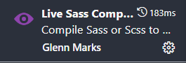
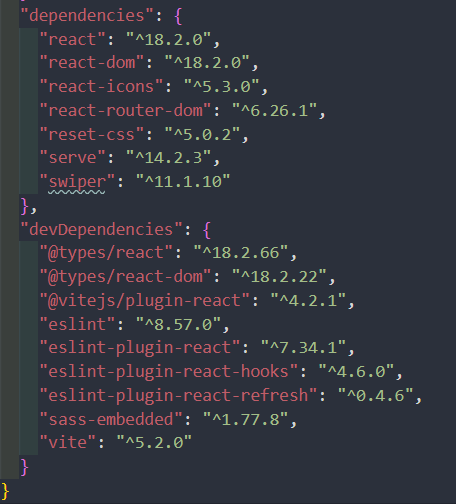

# CHARISMO - Feed Your Hair (React project, Frontend only)

This project is my first experience with React.

>This project was created with the purpose of learning React. I would be grateful for comments left on this project with your advice and comments.

**[==> View website](https://snazzy-zabaione-19c86e.netlify.app/)**

## Summary

* [Philosophy](#philosophy)
* [Licence](#licence)
* [Tools](#tools)
* [Installation](#installation)
* [Contacts](#contact-me)

## Philosophy
I tried to adhere to two main principles:

* [KISS](https://en.wikipedia.org/wiki/KISS_principle)
* [Unix philosophy](https://en.wikipedia.org/wiki/Unix_philosophy)

## Licence

Was created under the [MIT Licence](./LICENSE)

## Tools

 React 
 JSX 
 SCSS 
 Vite 

## Installation

To work with this project you will need **GIT**, **NPM**, **Node.js**, and **SASS**

**[==>How to install Git](https://git-scm.com/book/en/v2/Getting-Started-Installing-Git)**

**[==>How to install Node.js and NPM](https://docs.npmjs.com/downloading-and-installing-node-js-and-npm)**

>
> **[==>How to install SASS](https://sass-lang.com/install/)**
>
> ***OR***
>
>If you use  VSCode you can use the plugin "Live Sass Compiler"
>
>

### Local installation:

1. On the command line, navigate to the folder where the project will be deployed. Then copy it from GitHub :

`$ git clone https://github.com/saintgregoire/Charismo-React.git`

**While in the working directory in the terminal command line:** 

2. Installing dependencies:

`$ npm i `

## Contact me

